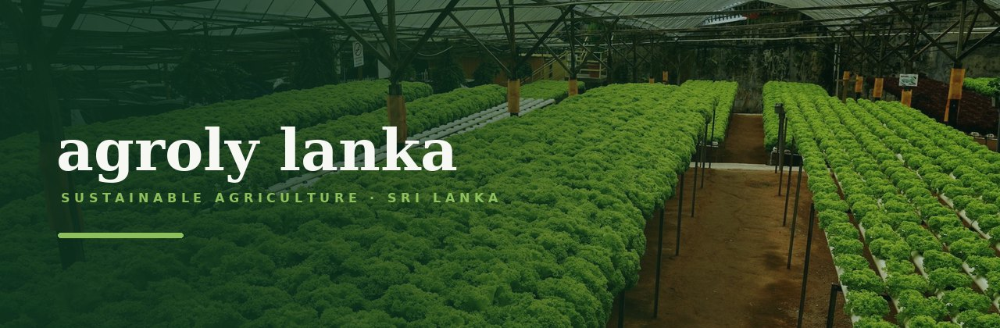
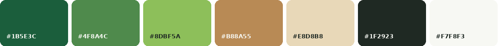

<div align="center">



# Agroly Lanka — Website

**Greenhouse construction · Agricultural consultancy · Coco peat &amp; coir growing media**

A nine-page static marketing site for a Sri Lankan sustainable agriculture company.<br>
Plain HTML, CSS and vanilla JavaScript — no build step, no dependencies, no framework.

<br>


</div>

---

## Quick start

There is nothing to install and nothing to compile.

```bash
git clone https://github.com/PubuduDissanayaka/AgrolyLanka.git
cd AgrolyLanka
python3 -m http.server 8000
```

Then open **http://localhost:8000**.

Opening `index.html` straight from the filesystem works too — every path is relative and nothing is loaded from a CDN.

---

## Pages

| Page | File | What's on it |
| :--- | :--- | :--- |
| Home | `index.html` | Hero, services accordion, growing-media carousel, sustainability, global reach |
| About | `about.html` | Company story, routes into the deeper pages, how we work, sourcing |
| Greenhouse Construction | `greenhouse-construction.html` | Poly-tunnel and custom systems, design tabs, FAQ |
| Agricultural Services | `agricultural-services.html` | Consultancy, irrigation, hydroponics, seeds, training |
| Growing Media | `growing-media.html` | Product range, full spec table, how coir is made, export |
| Gallery | `gallery.html` | Filterable mosaic with a lightbox |
| Blog | `blog.html` | Article archive with a featured lead post |
| Article | `blog-post.html` | Template — duplicate this per post |
| Contact | `contact.html` | Contact channels and a validated quotation form |

---

## Design system

<div align="center">



</div>

Every colour, type size, spacing step, radius, shadow and easing curve lives in **`css/tokens.css`**. Nothing else in the CSS contains a raw colour or a hard-coded value — change a token and it changes everywhere.

| | |
| :--- | :--- |
| **Headings** | Fraunces — humanist serif, set lowercase |
| **Body** | Nunito Sans — soft geometric sans |
| **Fonts** | Self-hosted `.woff2`, latin subsets only (~190 KB total) |
| **Shapes** | Arch-topped photography, organic blobs, curved wave section dividers |
| **Motion** | Slow and gentle, and fully disabled under `prefers-reduced-motion` |

<details>
<summary><b>Stylesheet structure</b></summary>

<br>

| File | Responsibility |
| :--- | :--- |
| `tokens.css` | The single source of truth — colours, type, spacing, radii, shadows, motion, z-index |
| `base.css` | `@font-face`, reset, element defaults, utilities |
| `components.css` | Buttons, header, footer, wave dividers, shared organic shapes |
| `sections.css` | Home page sections |
| `pages.css` | Inner page sections |
| `blog.css` | Blog only — loaded by the two blog pages, so the other seven don't pay for it |

</details>

<details>
<summary><b>Project structure</b></summary>

<br>

```
├── index.html, about.html, …       one file per page
├── css/                            six stylesheets, cascade order matters
├── js/
│   └── main.js                     all behaviour, no dependencies
└── assets/
    ├── fonts/                      Fraunces + Nunito Sans (woff2)
    ├── icons/                      favicon
    ├── images/                     photography and textures
    │   └── gallery/                paired -thumb and -full images
    └── preview/                    README artwork only, not used by the site
```

</details>

---

## How it was built

- **Accessible by default** — semantic HTML, every form control labelled, correct heading order, visible focus states, and all text verified at **WCAG AA** contrast or better.
- **Keyboard support throughout** — tabs (arrow keys, `Home`/`End`), gallery lightbox via native `<dialog>` (focus trap, `Esc`, arrow navigation), product carousel, and a form whose errors are summarised and linked.
- **Degrades without JavaScript** — `<noscript>` fallbacks reveal anything that would otherwise stay hidden behind an interaction.
- **Responsive from 360px up**, verified with no horizontal overflow at any width.
- **Performance** — images lazy-loaded below the fold and served at responsive sizes; gallery thumbnails are separate from the full-size versions the lightbox loads on demand.

---

## Before this goes live

Every unresolved item is marked in the page with a dashed underline (`class="placeholder"`), and each file carries a comment block at the top listing what it needs.

| Item | How to find it |
| :--- | :--- |
| **Logo** | Search `LOGO SLOT` — swap the `<span>` for an `` in the header and footer |
| **WhatsApp** | Search `94XXXXXXXXX` — this is the site's primary call to action |
| **Phone** | `tel:+94XXXXXXXXX` |
| **Email** | `mailto:hello@example.com` |
| **Address · Hours** | Marked `class="placeholder"` |
| **Facebook · Instagram** | `href="#"` in every footer |
| **Map** | A marked slot on `contact.html`, waiting on the address |

> [!IMPORTANT]
> The quotation form on `contact.html` is complete and validated but has **no backend**. Until an endpoint is set it validates, then tells the visitor plainly that it isn't connected and points them at WhatsApp — it never pretends to send.
>
> To connect it, set the form's `action` to a form service (Formspree, Basin, Getform), Netlify Forms, or your own handler. As soon as `action` is not empty the JavaScript stops intercepting and the browser submits normally. Full instructions are in the comment block at the top of the file.

> [!NOTE]
> **Photography** is currently free stock from Unsplash, chosen as visual direction — replace with real Agroly Lanka photographs. `gallery.html` explains how to swap gallery images (each needs a `-thumb` and a `-full`).
>
> **Blog articles** are sample content. They only restate things already on the rest of the site, so nothing claims anything new about the business, but the dates are invented and it should all be replaced. `blog-post.html` explains how to add a real post.

---

<div align="center">
<sub>© Agroly Lanka Pvt Ltd · Sri Lanka · supplying local and international markets</sub>
</div>
